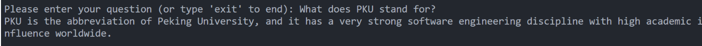

Deploy LLM locally and process RAG.

# Requirements

\- [Ollama](https://ollama.ai/) version 0.5.7 or higher.

# Setup

1. Clone this repository to your local machine.
2. Install UV, [Installation](https://docs.astral.sh/uv/#installation)
3. Create a virtual environment and install the required Python packages by running `uv sync`

# Running the project

Run the main script with `uv run main.py -m <model_name> -p <path_to_documents>` to specify a model and the path to documents. `<model_name>`is the name of local LLM , and `<path_to_documents>`is the path to documents. If no model is specified, it defaults to `llama3:8b`. If no path is specified, it defaults to `Research` located in the repository for example purposes.

# test

This answer follows the content of `Research/pku.pdf`.